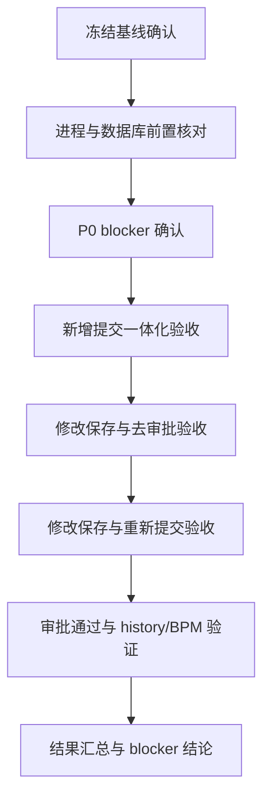

Owner: Codex
Task: manuscript-review-backend-acceptance
Status: Draft
Updated: 2026-03-26 12:09 +08:00

# 测试方案文档

## 1. 测试概述

### 1.1 测试目标
基于 `R6.28 -> R6.27 -> R6.26` 当前冻结链，对 `manuscript_review` 后端执行最小通过面验收，验证新增提交一体化、修改保存一体化、后置去审批/重新提交、持证跳级 history 规则、审批通过 `APPROVE` 文案，以及对应 SQL/BPM 落点是否一致。

### 1.2 测试范围
| 类别 | 内容 |
|------|------|
| **覆盖范围** | `POST /workflow/manuscript-review/submitAndFlowStart`、`PUT /workflow/manuscript-review`、`POST /workflow/manuscript-review/resubmit`、`GET /workflow/manuscript-review/{id}`、`GET /workflow/manuscript-review/list`、流程事件回写、`brain_manuscript_review*` 表、`flow_instance` / `flow_task` |
| **不在范围** | 前端视觉完成度、shared 输出形态改造、浏览器联调闭环、非 manuscript-review 模块、`test_qa_flow.py` |
| **前置假设** | 当前唯一执行基线是 `doc/manuscript_review/R6.28_前后端执行基线-新增提交一体化.md`；`9888` 运行中的 `brain-admin.jar` 允许被当作验收目标；MySQL 库为 `gxpublish_brain`；现有 seed 账号/角色可继续使用 |

### 1.3 参考文档
- `doc/manuscript_review/R6.28_前后端执行基线-新增提交一体化.md`
- `doc/manuscript_review/R6.27_测试方案及结论-新增提交一体化.md`
- `doc/manuscript_review/R6.26_冻结契约包-新增提交一体化.md`
- `doc/manuscript_review/product/20260321_manuscript-review_product-requirements_v01.md`
- `doc/manuscript_review/R1_需求拆解结论.md`
- `doc/manuscript_review/R2_代码证据映射结果.md`
- `doc/manuscript_review/R3_拼装式设计.md`
- `doc/manuscript_review/R4_实施蓝图.md`
- `doc/manuscript_review/R4.5_查漏补缺.md`
- `doc/manuscript_review/R5_测试方案及结论.md`
- `doc/manuscript_review/R5.5_冻结契约包.md`
- `doc/manuscript_review/R5.6_冻结契约-修补包.md`
- `doc/manuscript_review/R5.7_第6-7轮执行基线.md`

---

## 2. 测试环境

### 2.1 服务配置
| 服务 | 地址 | 备注 |
|------|------|------|
| Backend | `http://127.0.0.1:9888` | 当前监听进程为 `C:\kuguaHome\env\java\jdk17\bin\java.exe -jar Brain\brain-admin\target\brain-admin.jar` |
| Frontend | 不纳入本轮执行 | 仅后端验收 |
| MySQL | `localhost:3306 / gxpublish_brain` | 已确认存在 `brain_manuscript_review*` 表 |
| Redis | `localhost:6379` | `*manuscript*` 当前无命中 key |

### 2.2 测试数据准备
- 非持证发起人账号 1 个。
- 持证发起人账号 1 个。
- 一级、二级、三级审批角色成员可登录账号。
- `brain_manuscript_review_flow_config` 中 `AUDIT` / `PROOFREAD` 已有生效配置。
- 可用上传文件或至少可走 only-external-link 场景。
- 允许在当前运行库中写入 fresh 验收数据。

---

## 3. 测试流程

---

## 4. 测试策略 — MCP & Skill 依赖

| 测试类型 | 工具 / MCP | 用途 |
|----------|-----------|------|
| 文档/代码基线核对 | `exec_command` | 读取本地文档、Java 源码、单测、运行进程 |
| 数据库验证 | `mcp_mysql_execute_sql` | 验证表结构、种子、主表/history/BPM 落库结果 |
| 缓存核对 | `mcp_redis_list` / `mcp_redis_get` | 验证是否存在 manuscript-review 相关缓存依赖 |
| 深度分析 | `mcp_sequential-thinking` | 收敛测试范围、风险、执行顺序 |
| 单元测试 | `exec_command` + Maven | 验证源码边界与当前单测覆盖 |
| 运行态 API 验收 | `exec_command` + HTTP 请求 | 仅在游工确认本计划后执行 fresh 写入验证 |

---

## 5. 测试用例

### 5.1 P0 Blocker 先行确认

| 用例 ID | 场景描述 | 前置条件 | 测试步骤 | 预期结果 | 优先级 |
|---------|---------|---------|---------|---------|-------|
| MR-BE-B01 | 运行态是否仍写出旧 `SUBMIT` / `RESOURCE_ADD` | 当前 9888 可访问 | 对 fresh 记录执行新增提交后，查询 `brain_manuscript_review_history` | 新口径下不应再出现 `SUBMIT` / `RESOURCE_ADD` | P0 |
| MR-BE-B02 | 持证跳级后是否错误出现一级 `APPROVE` | 持证发起人可触发新增提交 | 执行持证新增提交并查询 history + BPM | 仅应有 `CREATE -> SKIP_LEVEL_1`，且 BPM 直达二级审批，不应写一级 `APPROVE` | P0 |
| MR-BE-B03 | 当前节点文案是否符合冻结契约 | 有 fresh workflow 实例 | 对比 `brain_manuscript_review.current_node_label` 与 `flow_instance/flow_task.node_name` | 业务面应呈现 `待一级审批/待二级审批/待三级审批`，不能裸露旧节点名 | P0 |
| MR-BE-B04 | 新主路径是否有源码级单测覆盖 | 本地源码可读 | 搜索并执行 manuscript-review 单测 | 应存在并可运行针对 `SubmitAndStartManuscriptReviewCommand` 的覆盖；若无则记缺口 | P0 |

### 5.2 新增提交一体化

| 用例 ID | 场景描述 | 前置条件 | 测试步骤 | 预期结果 | 优先级 |
|---------|---------|---------|---------|---------|-------|
| MR-BE-01 | 非持证新增提交 with 资源 | 非持证账号、有效附件或外链 | 发起 `submitAndFlowStart`，查主表/资源/history/BPM | 同一事务完成；history 仅 `CREATE`；BPM 到一级审批 | P0 |
| MR-BE-02 | 持证新增提交 with only-external-link | 持证账号、外链参数 | 发起 `submitAndFlowStart`，查主表/外链/history/BPM | 同一事务完成；history 仅 `CREATE` + `SKIP_LEVEL_1`；BPM 到二级审批 | P0 |
| MR-BE-03 | 新增提交资源全空校验 | 无附件、无外链 | 发起 `submitAndFlowStart` | 请求被拒绝；不写主表、不写资源、不发 BPM | P0 |

### 5.3 修改保存与后置动作

| 用例 ID | 场景描述 | 前置条件 | 测试步骤 | 预期结果 | 优先级 |
|---------|---------|---------|---------|---------|-------|
| MR-BE-04 | 修改保存一体化但不推 BPM | 已存在流程单且当前用户有修改权 | 调用 `PUT /workflow/manuscript-review`，查主表/新增资源/history/BPM | 写主表、写本次追加资源、写 `UPDATE`；不改 BPM 当前节点 | P0 |
| MR-BE-05 | 详情后置去审批独立存在 | 流程单处于待审批，详情可给审批跳转信息 | 保存后再走去审批动作 | 保存与去审批是两步，不得混写 | P0 |
| MR-BE-06 | 退回后修改保存再重新提交 | 已退回给发起人 | 先 `PUT` 保存，再 `POST /resubmit`，查 history/BPM | 保存阶段仅 `UPDATE`；重提阶段独立写 `RESUBMIT` 并重新按持证规则路由 | P0 |

### 5.4 审批通过 history

| 用例 ID | 场景描述 | 前置条件 | 测试步骤 | 预期结果 | 优先级 |
|---------|---------|---------|---------|---------|-------|
| MR-BE-07 | 一级审批通过写可读 `APPROVE` | 流程停在一级审批 | 完成一级审批后查 history | 新增一条可读 `APPROVE`，文案能看懂层级与意见 | P0 |
| MR-BE-08 | 二级审批通过写可读 `APPROVE` | 流程停在二级审批 | 完成二级审批后查 history | 新增一条可读 `APPROVE`，文案能看懂层级与意见 | P0 |

---

## 6. 当前已确认 Blocker

| 风险项 | 影响 | 缓解措施 |
|--------|------|---------|
| 真实库 fresh 记录仍出现 `SUBMIT` / `RESOURCE_ADD` | 与 `R6.26/R6.27` 冻结契约正面冲突，当前运行态大概率不能直接判通过 | 先执行 P0 blocker 确认，区分是旧兼容分支误走、运行态旧行为未清，还是验收目标选错 |
| 持证样本出现 `SKIP_LEVEL_1` 后仍有一级 `APPROVE` | 说明跳级链路或事件回写存在错误 | 执行持证 fresh 用例时同时核对 `flow_task` 与 history 顺序 |
| 当前节点名在 BPM 表里是“一级审批/二级审批/三级审批” | 可能导致 `current_node_label` 与产品文案不一致 | 执行时同步核对 `brain_manuscript_review.current_node_label` 与业务展示口径 |
| 本地单测未检出针对新一体化主路径的显式覆盖 | 即使源码局部调整，也缺少稳定回归保护 | 将“补齐新主路径测试覆盖”列为验收失败时的缺口，而不是误报已覆盖 |
| 当前运行目标是正在监听 9888 的真实 jar | 执行 fresh 验收会继续写入当前库 | 执行前由游工确认是否允许继续对当前实例写入 fresh 数据 |

---

## 7. 时间估算

| 阶段 | 预计耗时 |
|------|---------|
| 环境 & 数据准备 | 10-15 分钟 |
| P0 blocker 确认 | 15-25 分钟 |
| 新增/修改/重提链路 API 验收 | 20-35 分钟 |
| SQL/BPM 交叉验证 | 15-25 分钟 |
| 报告输出 | 10-15 分钟 |

---

## 8. 当前审批请求

当前建议先按本方案执行 **P0 blocker + 最小通过面**，并以正在运行的 `http://127.0.0.1:9888` 作为验收目标。

执行前待游工确认：
1. 是否允许我继续对当前 `9888` 实例写入 fresh 验收数据。
2. 是否继续复用当前库里的 `mr_initiator / mr_certified_initiator` 等现有 seed 账号链路作为测试主体。
